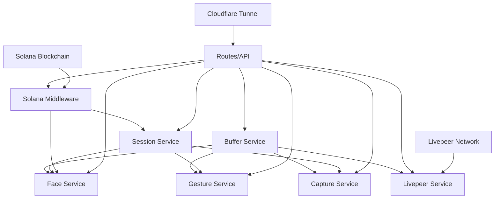

# Mmoment Camera Service Architecture

## Overview
The Mmoment camera service is built with a layered architecture that separates concerns and allows for modular development. The system processes camera frames through multiple parallel pipelines while maintaining efficient resource usage.

## System Layers

### Layer 1: Core Camera Buffer Service
**File**: `services/buffer_service.py`

The foundation of the entire system - handles direct camera interaction and frame management.

```
┌─────────────────────────────────────┐
│           Buffer Service            │
│  ┌─────────────────────────────────┐ │
│  │     Physical Camera Device      │ │
│  │     (USB/CSI/IP Camera)         │ │
│  └─────────────────────────────────┘ │
│  ┌─────────────────────────────────┐ │
│  │      Frame Buffering            │ │
│  │   • Ring buffer management      │ │
│  │   • Frame rate optimization     │ │
│  │   • Memory efficient storage    │ │
│  └─────────────────────────────────┘ │
└─────────────────────────────────────┘
```

**Key Responsibilities:**
- Camera device initialization and management
- Continuous frame capture and buffering
- Frame rate optimization and resource management
- Provides clean frame interface to upper layers

### Layer 2: Computer Vision Processing Services
**Files**: `services/face_service.py`, `services/gesture_service.py`, `services/capture_service.py`

Three parallel processing pipelines that consume frames from the buffer service:

```
                    ┌─────────────────┐
                    │  Buffer Service │
                    └─────────┬───────┘
                              │
            ┌─────────────────┼─────────────────┐
            │                 │                 │
            ▼                 ▼                 ▼
┌─────────────────┐ ┌─────────────────┐ ┌─────────────────┐
│  Face Service   │ │ Gesture Service │ │ Capture Service │
│                 │ │                 │ │                 │
│ • Face Detection│ │ • Hand Tracking │ │ • Photo Capture │
│ • Face Recogn.  │ │ • Gesture Recog │ │ • Video Record  │
│ • Face Boxes    │ │ • Gesture Tags  │ │ • Media Storage │
│ • NFT Integration│ │ • Gesture Boxes │ │ • File Management│
└─────────────────┘ └─────────────────┘ └─────────────────┘
```

#### Face Service Pipeline
- **Face Detection**: MTCNN/OpenCV face detection
- **Face Recognition**: FaceNet-based embedding comparison
- **NFT Integration**: Encrypted facial embeddings stored on Solana
- **Visual Overlays**: Face boxes and recognition results

#### Gesture Service Pipeline  
- **Hand Detection**: MediaPipe hand tracking
- **Gesture Recognition**: Custom gesture classification
- **Visual Overlays**: Hand landmarks and gesture labels

#### Capture Service Pipeline
- **Media Capture**: Photo and video recording
- **File Management**: Organized storage and retrieval
- **Metadata**: Timestamp and session information

### Layer 3: Integration and Streaming Services
**Files**: `services/livepeer_stream_service.py`, `services/session_service.py`, `solana_middleware/solana_middleware.py`

```
┌─────────────────────────────────────────────────────────┐
│                Integration Layer                        │
├─────────────────┬─────────────────┬─────────────────────┤
│ Livepeer Stream │ Session Service │ Solana Middleware   │
│                 │                 │                     │
│ • RTMP Streaming│ • User Sessions │ • Wallet Connection │
│ • Hardware Accel│ • Session Valid │ • NFT Verification  │
│ • Stream Status │ • Access Control│ • Face Encryption   │
│ • Auto Recovery │ • User Tracking │ • Blockchain Calls  │
└─────────────────┴─────────────────┴─────────────────────┘
```

### Layer 4: API and Frontend Bridge
**File**: `routes.py`

Standardized REST API that bridges all services to external applications:

```
┌─────────────────────────────────────────────────────────┐
│                  API Layer (routes.py)                 │
├─────────────────┬─────────────────┬─────────────────────┤
│ Standardized    │ Legacy Support  │ Real-time Endpoints │
│ Endpoints       │ Endpoints       │                     │
│                 │                 │                     │
│ /api/health     │ /health         │ /mjpeg-stream       │
│ /api/capture    │ /connect        │ /api/stream/status  │
│ /api/face/enroll│ /enroll_face    │ /test-page          │
│ /api/session/*  │ /recognize_face │ /local-test         │
└─────────────────┴─────────────────┴─────────────────────┘
```

### Layer 5: External Connectivity
**Infrastructure**: Cloudflare Tunnel, Livepeer Network, Solana Blockchain

```
┌─────────────────────────────────────────────────────────┐
│                External Connectivity                    │
├─────────────────┬─────────────────┬─────────────────────┤
│ Cloudflare      │ Livepeer        │ Solana Blockchain   │
│ Tunnel          │ Network         │                     │
│                 │                 │                     │
│ • Public APIs   │ • Live Streaming│ • Camera Registry   │
│ • Web UI Access │ • Global CDN    │ • User Sessions     │
│ • SSL/Security  │ • Transcoding   │ • Face NFTs         │
│ • Load Balancing│ • Playback URLs │ • Access Control    │
└─────────────────┴─────────────────┴─────────────────────┘
                               │
                               ▼
┌─────────────────────────────────────────────────────────┐
│              Camera's Solana PDA Account               │
│                                                         │
│ • Camera Registration & Metadata                       │
│ • User Check-in/Check-out Records                      │
│ • Access Control & Permissions                         │
│ • Activity Logging & Analytics                         │
│ • NFT-based Authentication Gateway                     │
└─────────────────────────────────────────────────────────┘
```

## Data Flow Architecture

### Frame Processing Flow
```
Camera → Buffer → [Face, Gesture, Capture] → Visual Overlay → Stream/API
```

### User Authentication Flow
```
Frontend → Cloudflare → API → Session Service → Solana Middleware → Blockchain
```

### Face Recognition Flow
```
Camera Frame → Face Detection → Face Recognition → NFT Verification → Access Grant
```

### Streaming Flow
```
Buffer → Livepeer Service → RTMP → Livepeer Network → Global CDN → Frontend
```

## Service Dependencies



## Key Design Principles

### 1. Modular Architecture
- Each service is independent and can be started/stopped individually
- Clear interfaces between layers
- Minimal coupling between services

### 2. Resource Efficiency
- Single camera buffer shared across all services
- Efficient frame processing with configurable intervals
- Hardware acceleration where available

### 3. Blockchain Integration
- NFT-based user authentication
- Encrypted facial embeddings
- Decentralized access control

### 4. Scalability
- Standardized APIs for easy frontend integration
- Cloudflare tunnel for global accessibility
- Livepeer network for scalable streaming

### 5. Privacy & Security
- Local processing of biometric data
- Encrypted storage of facial embeddings
- User-owned identity via NFTs

## Configuration Files

- **`main.py`**: Service initialization and coordination
- **`routes.py`**: API endpoint definitions
- **`config/`**: Service-specific configurations
- **`systemd/`**: Service management scripts

## Testing & Development

- **`templates/local_test.html`**: Local development interface
- **Port Forwarding**: Direct MJPEG stream testing
- **API Testing**: Standardized endpoint testing
- **Integration Testing**: End-to-end workflow validation

## Future Architecture Extensions

### Computer Vision App Store
The current architecture is designed to support a future "CV App Store" where:
- Apps can register as processing plugins
- NFT-based access control per app
- Standardized CV pipeline interfaces
- Revenue sharing via blockchain transactions

### Multi-Camera Networks
- Camera discovery and networking
- Distributed processing capabilities
- Cross-camera user recognition
- Network-wide analytics and insights 